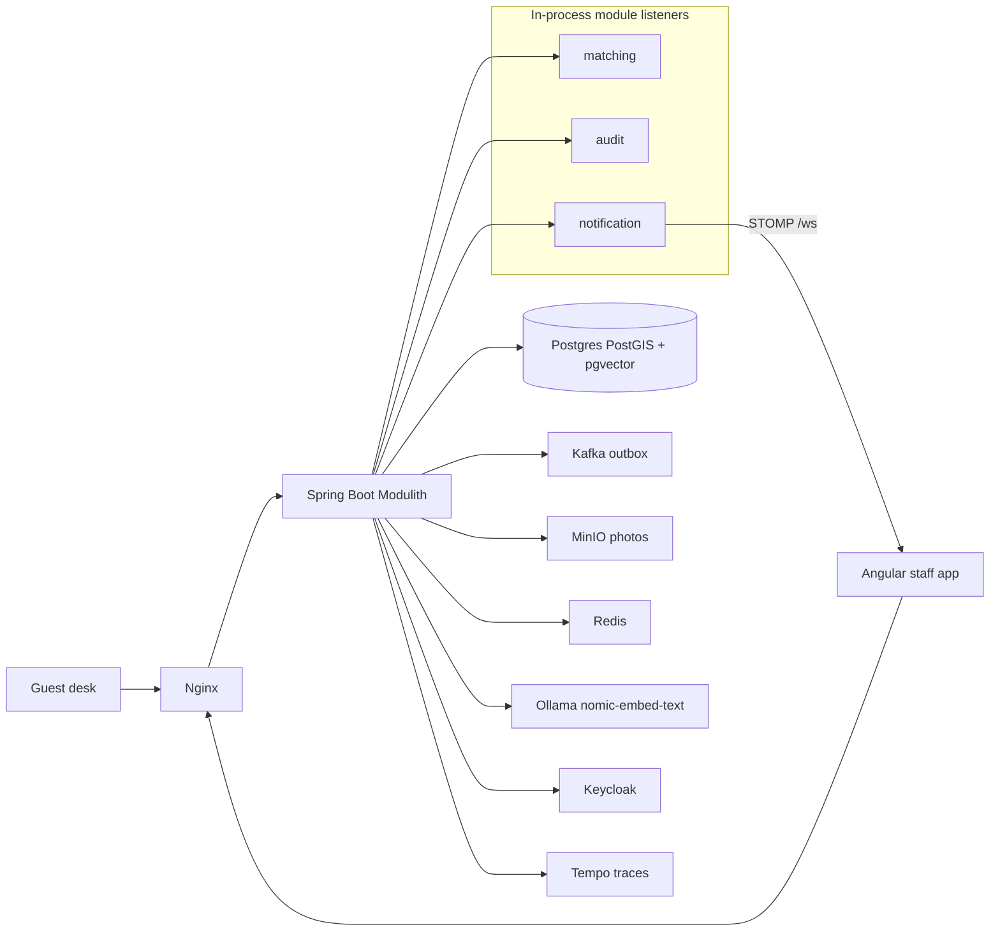

# Hotel Asset Recovery

Staff-first lost-and-found platform for hotels. Housekeeping logs found items, guests (or the front desk) file loss reports, and duty managers review hybrid matches.

This is a **modular monolith**: one Spring Boot application with enforced module boundaries, not a pile of microservices.

**Repository:** [github.com/Hamza-spc/hotel-asset-recovery](https://github.com/Hamza-spc/hotel-asset-recovery)
[](https://github.com/Hamza-spc/hotel-asset-recovery/actions/workflows/ci.yml)

## Status

v1 + guest desk. Guests file at `/guest`. Staff still own accept/reject. The match inbox is a read; rebuilding embeddings is an explicit manager action.

## Stack

- Java 21, Spring Boot 4.1, Spring Modulith 2.1
- Angular 21 staff app (Leaflet `CRS.Simple` map, STOMP live board)
- Keycloak (OAuth2/OIDC) with `HOUSEKEEPING`, `FRONT_DESK`, `DUTY_MANAGER`
- Docker Compose: PostgreSQL 16 + PostGIS + pgvector, Kafka, Redis, MinIO, Ollama, Prometheus, Grafana, Tempo, Nginx

## Architecture



Modules: `identity` · `inventory` · `claims` · `location` · `matching` · `notification` · `audit`

`ModularityTests` verifies those boundaries and writes PlantUML to `docs/modulith`. Matching calls inventory and claims through public ports so the graph stays acyclic. The same domain events go to Kafka (`lostfound.inventory`, `lostfound.claims`, `lostfound.matching`) through the Modulith outbox.

**Hybrid score:** `0.7 * (1 - embedding <=> embedding) + 0.3 * (1 - min(hypot / 40, 1))`. Missing coordinates contribute `0.5` on the spatial term. Suggestions below `0.52` are dropped.

## How it works

The interview talk track. Same words live at [http://localhost:4200/how-it-works](http://localhost:4200/how-it-works).

1. **Someone writes a fact.** Housekeeping logs a found item, or a guest / front desk files a loss report. That is a command on an aggregate. Illegal status jumps throw before save.
2. **The transaction owns the outbox.** The same Postgres transaction writes the aggregate and a Modulith event publication. After commit, in-process listeners run (matching, audit, STOMP). The event is also externalized to Kafka (`lostfound.inventory`, `lostfound.claims`, `lostfound.matching`) for anything outside this process. Kafka is not how the monolith talks to itself.
3. **Matching embeds, then scores.** Matching calls inventory and claims through public ports so the module graph stays acyclic. Ollama `nomic-embed-text` stores a 768-d vector in pgvector. Combined score is `0.7 × text + 0.3 × spatial`. Text is cosine (`1 − embedding <=> embedding`). Spatial is `1 − min(hypot / 40, 1)`; missing pins contribute `0.5`. Below `0.52` is dropped.
4. **Staff decide. Guests do not.** Duty managers accept or reject on `/matches`. Accept opens a claim and resolves the report; siblings are rejected. `GET /api/matches` only reads pending rows — it does not call Ollama. If embeddings were skipped (Ollama down at write time), the manager hits **Rebuild embeddings** (`POST /api/matches/reindex`).

## Local run

Use Java 21. Homebrew Maven may pick a newer JDK; point `JAVA_HOME` at JDK 21.

```bash
export JAVA_HOME=$(/usr/libexec/java_home -v 21)

docker compose -f infra/docker-compose.yml up -d

cd backend && ./mvnw spring-boot:run
cd frontend && npm start
```

Open [http://localhost:4200](http://localhost:4200). Compose Postgres is on **5433** so it does not collide with Homebrew Postgres on 5432.

| Service        | URL                         | Login            |
| -------------- | --------------------------- | ---------------- |
| Staff app      | http://localhost:4200       | table below      |
| Guest desk     | http://localhost:4200/guest | no login         |
| How it works   | http://localhost:4200/how-it-works | —          |
| Keycloak       | http://localhost:8081       | `admin` / `admin` |
| Grafana        | http://localhost:3000       | `admin` / `admin` |
| MinIO console  | http://localhost:9001       | `lostfound` / `lostfoundsecret` |
| Ollama         | http://localhost:11434      | —                |
| Tempo OTLP     | http://localhost:4318       | —                |

`nomic-embed-text` is pulled on first match (or `docker exec hotel-asset-recovery-ollama-1 ollama pull nomic-embed-text`).

### Demo users (local only)

| Username    | Password    | Role          |
| ----------- | ----------- | ------------- |
| housekeeper | housekeeper | HOUSEKEEPING  |
| frontdesk   | frontdesk   | FRONT_DESK    |
| manager     | manager     | DUTY_MANAGER  |

## Demo script

The interview walkthrough. Seed item **LF-2026-0002** is already a black leather wallet pinned at Lobby `(13, 60.2)`.

1. Sign in as `housekeeper`. Log a found wallet on the lobby sofa (or skip — LF-2026-0002 is already stored).
2. Open `/guest` (no login). File the same wording, same lobby pin, as Amelia Chen, room 412. Keep the receipt. Front desk can still file on a guest's behalf from `/file-report`.
3. Sign out. Sign in as `manager`. Open **Matches**. The exact pair scores 100% text and 100% distance; a similar wallet without coordinates scores lower on the spatial term.
4. Accept the top suggestion. The inbox clears, the item becomes `CLAIM_PENDING`, the report becomes `RESOLVED`, and the board ticker says `Claim opened`.
5. Open **Audit** for `MATCH_SUGGESTED` → `MATCH_ACCEPTED`. In Grafana, use Explore → Tempo and the provisioned **Hotel Asset Recovery API** dashboard.

Same pair from the shell (creates a fresh timestamped item + report, then lists the inbox):

```bash
chmod +x scripts/demo-pair.sh
./scripts/demo-pair.sh
```

## Load test

Read path of the duty-manager board (health, `/api/me`, items, reports, map zones, audit, matches):

```bash
k6 run k6/staff-board.js
```

Local run on this machine (10 VUs, 30s) after embeddings were already built:

| Metric                  | Result   |
| ----------------------- | -------- |
| requests                | 4,027    |
| `http_req_failed`       | 0%       |
| checks                  | 100%     |
| `http_req_duration` p95 | 142 ms   |
| throughput              | 117 req/s |

Thresholds in the script: error rate `< 1%`, p95 `< 500ms`.

## Layout

```
backend/    Spring Boot API
frontend/   Angular staff UI
infra/      Compose, Keycloak, Nginx, Prometheus, Grafana
k6/         staff-board load test
docs/       Modulith PlantUML
scripts/    demo-pair.sh
```

## License

MIT
